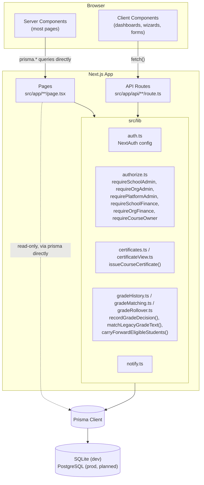
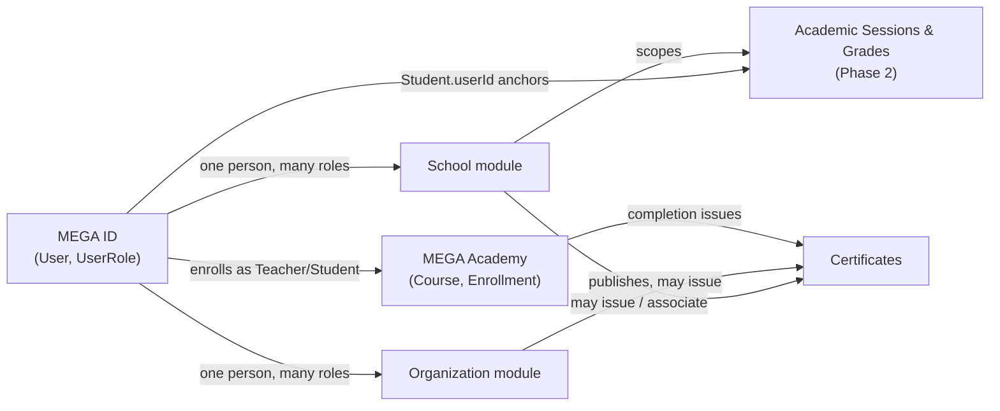

# Architecture

> Status legend: **✅ Implemented** · **🟡 Designed/approved, not yet implemented** · **⚠️ Known gap/issue** · **🔭 Future/planned**
> Last verified: 2026-08-29 (Phase 3A), against the current codebase.

## High-level shape ✅

MEGA.EDU is a single Next.js 14 App Router application — no separate backend service. Pages and API routes live side by side under `src/app`, both talking to the same Prisma client (`src/lib/prisma.ts`) against one SQLite database file (`prisma/dev.db` in dev).

```
src/
  app/                 # pages (App Router) + API routes, colocated
    api/               # route.ts handlers, grouped by resource
    dashboard/         # role-specific dashboard pages/components
      setup/           # Phase 2: Initial School Setup wizard
      grades/          # Phase 2: per-grade Promotion rosters + Pending queue
      sessions/new/    # Phase 2: New Session rollover
      academics/       # Phase 3A: Subject catalog, grade offerings, teacher assignments
    admin/             # Platform Admin-only pages
    ...                # public pages: schools, courses, opportunities, etc.
  components/          # shared client components (SiteHeader, DashboardHero, certificate/)
  lib/                 # server-side helpers: auth, authorize, prisma, notify,
                        # certificates, certificateView, gradeHistory,
                        # gradeMatching, gradeRollover
  types/               # ambient type augmentation (next-auth.d.ts)
prisma/
  schema.prisma        # single source of truth for the data model
  seed.ts               # idempotent demo data + platform fixtures (upserts)
```

## System diagram



## Rendering pattern ✅

Two consistent patterns are used throughout, not mixed within one page:

1. **Server component fetches Prisma directly, renders (or passes props to) a client component.** The dominant pattern for anything showing a logged-in user their own data: `dashboard/page.tsx` branches on role, runs the relevant Prisma query, and hands a fully-hydrated object to a `"use client"` component. All of Phase 2's pages (`setup/page.tsx`, `grades/page.tsx`, `grades/[schoolGradeId]/page.tsx`, `sessions/new/page.tsx`) follow this exact pattern — resolve the admin's school server-side, fetch everything the page needs, pass typed props to a client component that owns the interactive state.
2. **Client component fetches its own API route.** Used for mutations and independently-polled data (`StudentSkillManager`, the notification bell). The mutation flow is consistently: `fetch()` → check `res.ok` → `router.refresh()` (server components re-run, client state stays put).

There is no client-side global state manager — `router.refresh()` is the app's entire "revalidate after mutation" strategy.

## The `src/lib` layer — "the only path" pattern ✅

A recurring, deliberate decision (see [PRODUCT_RULES.md](PRODUCT_RULES.md)): for any write that must be atomic with a side effect or must never be bypassed, the codebase centralizes it into one function, and every caller goes through it rather than calling `prisma.<model>.update` directly:

- **`issueCourseCertificate()`** (`certificates.ts`) — the only place a `Certificate` row is created for a course.
- **`recordGradeDecision()`** (`gradeHistory.ts`) — the only place a `GradeHistory` row's `status`/`outcomeGradeId` may change, always paired with a `GradeHistoryAudit` insert.
- **`reassignSection()`** (`gradeHistory.ts`) — the only place a `GradeHistory` row's `sectionId` may change once the row already exists, same audited shape as `recordGradeDecision()` but a fully independent write path (neither function touches the other's fields).
- **`carryForwardEligibleStudents()`** (`gradeRollover.ts`) — the only place new-session placements get auto-created from a prior decision; idempotent and re-runnable. Never sets `sectionId` on the row it creates.

All four follow the same shape: typed input, optional `tx?: Prisma.TransactionClient` for composing into a larger transaction, transactional by default otherwise.

Other `lib` modules: **`auth.ts`** (NextAuth config), **`authorize.ts`** (the `requireX` guard suite — see [AUTHENTICATION_AND_AUTHORIZATION.md](AUTHENTICATION_AND_AUTHORIZATION.md)), **`prisma.ts`** (singleton client), **`notify.ts`** (best-effort notifications, never allowed to fail the calling action), **`certificateView.ts`** (pure view-model builder, no live text lookups), **`gradeMatching.ts`** (`matchLegacyGradeText()` — never guesses, returns `null`).

## Major application modules and how they relate ✅



A school and an organization are structurally independent — a `Course` belongs to an `Organization`, never a `School`, and Phase 2's grade structure belongs entirely to a `School`, with no organization involvement. The two only meet at `Certificate.associatedSchoolId`, an informational link (the recipient's school), not an ownership relation.

## Data model conventions ✅

See [DATABASE.md](DATABASE.md) for the full model inventory. Two conventions apply project-wide:

- **No Prisma `enum`s, ever** — SQLite's connector doesn't support them, even unused ones.
- **Snapshot fields for anything that must survive a later rename** — `Certificate.*NameSnapshot` and `GradeHistoryAudit.previous*/new*` are plain values, not live FK relations. Logos are the one deliberate exception (looked up live). Full rationale in [PRODUCT_RULES.md](PRODUCT_RULES.md).

## Migration discipline ✅

Both Phase 1 and Phase 2 followed the same additive-first sequence, enforced manually (not by tooling):

1. Add new models/fields additively — nothing existing removed in the same pass.
2. Before applying anything that could conflict with existing data, write a one-off verification script, run it, confirm no conflicts, delete the script.
3. Apply with `npx prisma db push` (no `prisma migrate`/`migrations/` folder — appropriate for the current single-environment SQLite setup).
4. Only after a change is applied and verified does any "clean up the old thing" pass happen — and some legacy fields (`Student.gradeLevel`) are intentionally never dropped.

## Testing 🔭

No test framework is installed. See [TESTING.md](TESTING.md) for what verification practice is used instead.

## Deployment 🔭

See [DEPLOYMENT.md](DEPLOYMENT.md) — no production infrastructure exists yet; only local development is configured.
