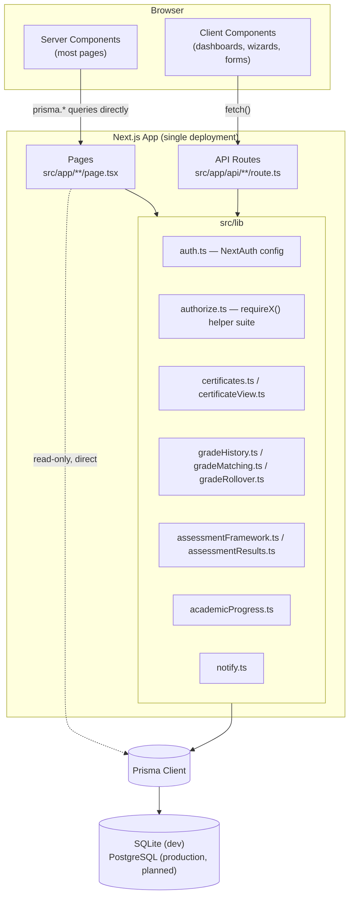
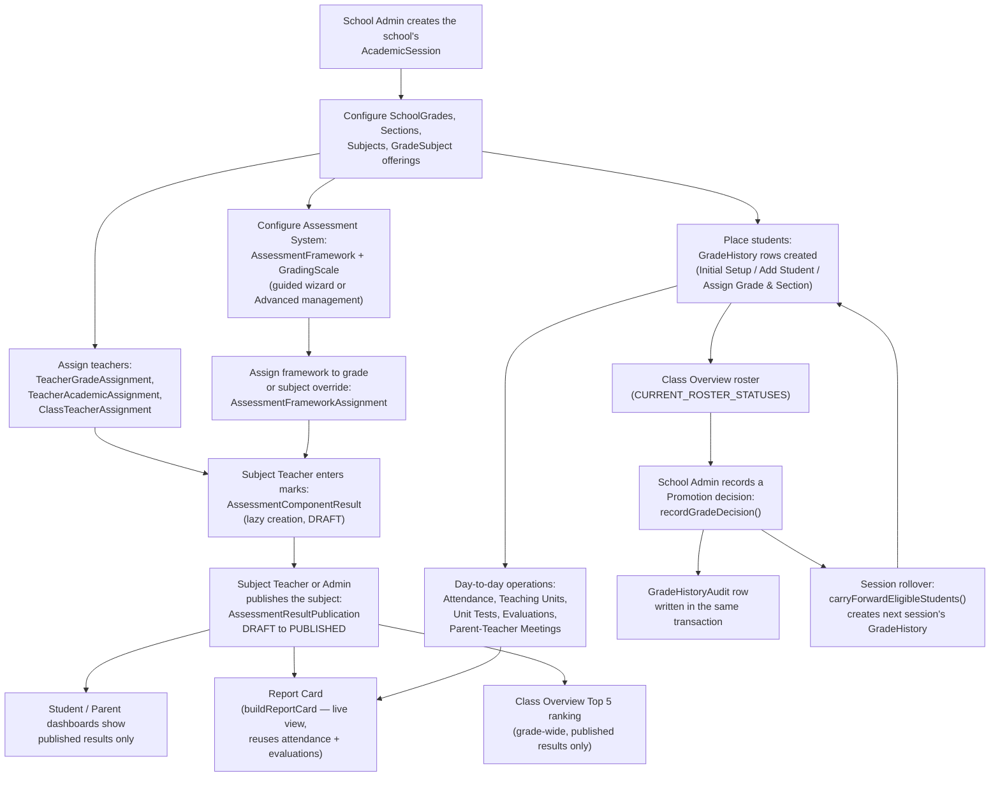
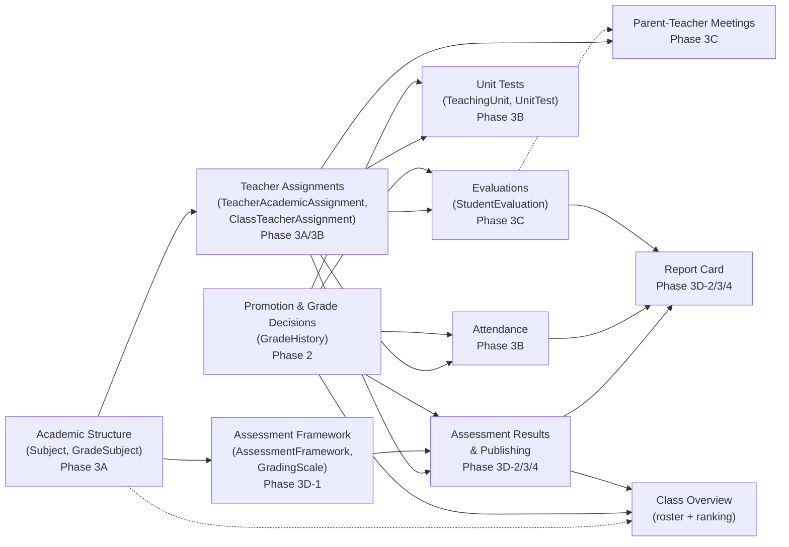

# MEGA.EDU — Technical Documentation

> **Audience**: developers, technical team members, system administrators, and future maintainers.
> **Status legend** (used throughout): **✅ Implemented** · **🟡 Designed/approved, not yet implemented** · **⚠️ Known gap/issue** · **🔭 Future/planned**
> **Last verified**: 2026-08-31, against the current codebase and the audited `/docs` documentation set.
> **Source discipline**: every claim in this document is drawn from the existing, individually-audited documents in `/docs` (cross-referenced throughout) and, where a doc was ambiguous, from direct inspection of the implementation. Nothing here describes a planned or hypothetical feature as if it were built. Where something is designed but not implemented, or implemented but deliberately incomplete, that is stated explicitly.

---

## Table of Contents

1. [Introduction & Purpose of This Document](#1-introduction--purpose-of-this-document)
2. [System Overview](#2-system-overview)
3. [System Data Flow](#3-system-data-flow)
4. [Module Dependency Map](#4-module-dependency-map)
5. [Technology Stack](#5-technology-stack)
6. [Project Structure](#6-project-structure)
7. [Database Architecture & Prisma Models](#7-database-architecture--prisma-models)
8. [Authentication & Authorization](#8-authentication--authorization)
9. [User Roles & Permissions](#9-user-roles--permissions)
10. [School & Multi-School Architecture](#10-school--multi-school-architecture)
11. [Academic Sessions, Grades, Sections & Subjects](#11-academic-sessions-grades-sections--subjects)
12. [Student Lifecycle & GradeHistory](#12-student-lifecycle--gradehistory)
13. [Teacher Assignments & Authorization Scopes](#13-teacher-assignments--authorization-scopes)
14. [Attendance System](#14-attendance-system)
15. [Evaluations](#15-evaluations)
16. [Parent–Teacher Meetings](#16-parentteacher-meetings)
17. [Unit Tests](#17-unit-tests)
18. [Assessment Framework System](#18-assessment-framework-system)
19. [Assessment Results & Publishing Workflow](#19-assessment-results--publishing-workflow)
20. [Grading & GPA Calculations](#20-grading--gpa-calculations)
21. [Report Card Architecture](#21-report-card-architecture)
22. [Promotion & Grade Decisions](#22-promotion--grade-decisions)
23. [Certificate System](#23-certificate-system)
24. [Dashboard Architecture](#24-dashboard-architecture)
25. [API Architecture & Major Routes](#25-api-architecture--major-routes)
26. [Business Rules & Data Integrity Protections](#26-business-rules--data-integrity-protections)
27. [Audit Trails](#27-audit-trails)
28. [Security Model](#28-security-model)
29. [Calculation Engines & Shared Libraries](#29-calculation-engines--shared-libraries)
30. [Deployment & Setup Requirements](#30-deployment--setup-requirements)
31. [Environment Variables](#31-environment-variables)
32. [Database Migration & Update Procedures](#32-database-migration--update-procedures)
33. [Development Workflow & Verification](#33-development-workflow--verification)
34. [Maintenance Guidelines](#34-maintenance-guidelines)
35. [Known Gaps & Deliberate Out-of-Scope Decisions](#35-known-gaps--deliberate-out-of-scope-decisions)
36. [Appendix: Documentation Index](#36-appendix-documentation-index)

---

## 1. Introduction & Purpose of This Document

This document is a single technical reference for MEGA.EDU, consolidating the detailed, individually-verified documents already maintained under `/docs` (each covering one subsystem in depth) into one narrative a new developer, system administrator, or maintainer can read top to bottom. It does not replace those documents — it cross-references them throughout, and the reader is expected to follow those links for full implementation detail (exact request/response shapes, full verification evidence, field-by-field schema notes). This document is the map; the individual `/docs` files are the territory.

Everything below reflects the system **as implemented and verified**, as of the phases completed through **Phase 3D-2/3/4** (Assessment Results, Publishing, Report Cards) plus the subsequent **guided Assessment Wizard** and **Class Overview** enhancements. Nothing here is invented, and nothing planned is described as available today — see [§35](#35-known-gaps--deliberate-out-of-scope-decisions) for what is deliberately out of scope versus genuinely missing.

---

## 2. System Overview

**MEGA.EDU** is a national education network connecting schools, teachers, students, parents, and education organizations under one identity system, **MEGA ID**. A school gets a public profile and a digital identity; teachers and students at that school get accounts a school administrator approves; organizations can publish free online courses (MEGA Academy) and post opportunities; parents can follow their children's academic progress. Everyone signs in with the same account type, regardless of role.

The platform's purpose is to give every school, teacher, and student a **verifiable digital presence**: a school's identity isn't tied to one administrator's login, a student's academic record and certificates follow *them* rather than staying locked inside one school's paperwork, and achievements are independently verifiable by anyone with the right link.

### High-level architecture

MEGA.EDU is a **single Next.js 14 App Router application** — there is no separate backend service. Pages and API routes are colocated under `src/app`, both talking to the same Prisma client against one database.



<details>
<summary><strong>Technical Mermaid Source (for future editing)</strong></summary>



</details>

*(Source: [ARCHITECTURE.md](ARCHITECTURE.md))*

There is no client-side global state manager. `router.refresh()` — re-running the server component and re-fetching its data — is the application's entire "revalidate after mutation" strategy, following a `fetch()` → check `res.ok` → `router.refresh()` mutation flow throughout.

---

## 3. System Data Flow

The diagram below traces the major academic and assessment data flows a real school follows during a session — from setup through to a published Report Card and a promotion decision. It complements, rather than duplicates, the [Module Dependency Map](#4-module-dependency-map) below: this shows the *order things happen in*, the map shows *what depends on what structurally*.



<details>
<summary><strong>Technical Mermaid Source (for future editing)</strong></summary>



</details>

**Reading this diagram**: setup (session, grades, sections, subjects, teachers, students) must happen before any daily operations can run, since attendance, evaluations, units, and assessment entry are all scoped to a `GradeHistory`/`TeacherAcademicAssignment` combination that must already exist. Assessment results and Report Cards are the only flow that terminates in something a Parent/Student ever sees directly — every other flow (attendance, evaluations, unit tests) is visible to Student/Parent as read-only progress data, not a publish-gated artifact. Promotion is the flow that closes the loop back to a new `GradeHistory` row for the next session.

---

## 4. Module Dependency Map

This map shows structural dependencies between the major Phase 3 modules — an arrow means "the module at the arrow's head cannot function without data or authorization state from the module at its tail."


<details>
<summary><strong>Technical Mermaid Source (for future editing)</strong></summary>



</details>

*Solid arrows are hard, load-bearing dependencies (the dependent module's routes or queries directly reference the depended-on module's rows). Dotted arrows are looser, informational relationships (e.g. a `ParentTeacherMeeting` may link to an `StudentEvaluation`, but neither requires the other to exist).*

Key structural facts this map summarizes:

- **`GradeHistory` (Promotion/`PROMO`) underlies everything.** Attendance, Unit Tests, Evaluations, and Assessment Results all resolve a student's current placement through `GradeHistory`, not an independently-maintained roster.
- **`TeacherAcademicAssignment`/`ClassTeacherAssignment` gate almost every teacher-facing write.** Attendance and general Evaluations require `requireClassTeacher()`; Unit Tests, Subject Evaluations, and Assessment Results marks entry all require `requireTeacherAssignment()` scoped to the exact subject.
- **Assessment Results is the only module both Report Card and Class Overview ranking depend on.** Both reuse `fetchAssessmentResults()`/`buildReportCard()` — see [§20](#20-grading--gpa-calculations) and [§29](#29-calculation-engines--shared-libraries).
- **Promotion (`recordGradeDecision()`) has no dependency on Assessment Results at all** — a Promotion decision can be recorded with zero assessment data ever entered. The relationship only exists in the *display* direction: Class Overview reads both the roster (from `GradeHistory`) and the ranking (from Assessment Results) on the same page, but neither module's write path touches the other.

---

## 5. Technology Stack

| Layer | Technology | Notes |
|---|---|---|
| Framework | Next.js 14 (App Router) | Single deployment, pages and API routes colocated |
| UI | React 18, TypeScript | No separate frontend framework or SPA build |
| Styling | Tailwind CSS | Utility-first, no CSS-in-JS library |
| ORM | Prisma 5.20 | Single `PrismaClient` singleton (`src/lib/prisma.ts`) |
| Database (dev) | SQLite | Single file, `prisma/dev.db` |
| Database (production, planned) | PostgreSQL 🔭 | Never configured or tested — see [§30](#30-deployment--setup-requirements) |
| Authentication | NextAuth 4 | Single Credentials provider, JWT session strategy |
| Password hashing | `bcryptjs` | `bcrypt.compare`/`bcrypt.hash(password, 10)` |
| Validation | `zod` | Used on registration routes |
| Dev tooling | TypeScript compiler, ESLint (`next lint`), Prisma Studio | No automated test framework installed — see [§33](#33-development-workflow--verification) |

*(Source: [PROJECT_OVERVIEW.md](PROJECT_OVERVIEW.md), [DEPLOYMENT.md](DEPLOYMENT.md))*

**No Prisma `enum`s are used anywhere in this schema** — SQLite's Prisma connector doesn't support them, even unused ones. Every status/type/role field is a plain `String`, with valid values documented in a comment above the field. This is a project-wide, explicitly-approved rule (see [§26](#26-business-rules--data-integrity-protections)), not an oversight, and it is intended to remain the convention even after a future move to PostgreSQL (which does support enums).

---

## 6. Project Structure

```
src/
  app/                    # pages (App Router) + API routes, colocated
    api/                  # route.ts handlers, grouped by resource
    dashboard/            # role-specific dashboard pages/components
      setup/               # Initial School Setup wizard (Phase 2)
      grades/              # Class Overview / Promotion rosters + Pending queue
      sessions/new/        # New Session rollover
      academics/           # Subject catalog, grade offerings, teacher assignments,
                           #   [gradeSubjectId]/ — Teaching Plans, Units, Tests
      attendance/          # Daily attendance marking + correction
      evaluations/         # General Student Evaluations + meeting scheduling
      meetings/            # Cross-role Parent-Teacher Meetings management
      students/[studentId]/    # Staff-only Student Profile page
      assessment-frameworks/   # Landing page, guided wizard, Advanced management
      assessment-results/      # Marks entry, publish workflow
      report-card/[studentId]/ # Live Report Card view
    admin/                 # Platform Admin-only pages
    ...                    # public pages: schools, courses, opportunities, etc.
  components/              # shared client components (SiteHeader, DashboardHero,
                           #   AcademicProgressPanel, MeetingActions, certificate/)
  lib/                     # server-side helpers — see §29
  types/                   # ambient type augmentation (next-auth.d.ts)
prisma/
  schema.prisma            # single source of truth for the data model
  seed.ts                  # idempotent demo data + platform fixtures (upserts)
```

*(Source: [ARCHITECTURE.md](ARCHITECTURE.md))*

### Rendering pattern

Two consistent patterns are used throughout, never mixed within one page:

1. **Server component fetches Prisma directly, renders (or passes props to) a client component.** The dominant pattern for a logged-in user's own dashboard data — `dashboard/page.tsx` branches on role, runs the relevant Prisma query, hands a fully-hydrated object to a `"use client"` component. Every Phase 2/3 configuration and roster page follows this.
2. **Client component fetches its own API route.** Used for mutations and independently-polled data (e.g. the notification bell). The mutation flow is consistently `fetch()` → check `res.ok` → `router.refresh()`.

### The `src/lib` layer — "the only path" pattern

A recurring, deliberate architectural decision: for any write that must be atomic with a side effect, or must never be bypassed, the codebase centralizes it into one function, and every caller goes through it rather than calling `prisma.<model>.update()` directly. See [§29](#29-calculation-engines--shared-libraries) for the full inventory.

---

## 7. Database Architecture & Prisma Models

**Datasource**: SQLite in development (`prisma/dev.db`); the schema's own header comment and `.env.example` both mark PostgreSQL as the intended production target — nothing production-specific is configured yet. Every model below is ✅ implemented (exists, migrated, and has at least one route reading/writing it) unless marked otherwise. Full field-by-field detail lives in [DATABASE.md](DATABASE.md); this section is an organized summary.

### MEGA ID & roles
- **`User`** — the single identity record (email unique, `passwordHash`, `name`). Every other model traces back to a `User` for who did what.
- **`UserRole`** — which role(s) a user holds (`PLATFORM_ADMIN | SCHOOL_ADMIN | TEACHER | STUDENT | PARENT | ORGANIZATION_ADMIN | ACCOUNTANT`), `@@unique([userId, role])` — a user can hold several different roles at once.

### Schools & Organizations
- **`School`** — `verified`/`isActive` flags (⚠️ `isActive` is read in two places but nothing ever sets it `false` — no deactivation action exists), `logoUrl` (unpopulated on every school today).
- **`SchoolAdmin`/`SchoolAccountant`** — join tables granting access to one school.
- **`Organization`**, **`OrganizationAdmin`/`OrganizationAccountant`** — the parallel structure for MEGA Academy publishers. ⚠️ `Organization` has no `logoUrl` field in the schema at all.

### People
- **`Teacher`**, **`Student`** — optional 1:1 with `User`, optional `schoolId`, `approved` flag. `Student.gradeLevel` is the **permanent legacy free-text grade fallback** — retained forever, never dropped, no longer written once a school completes Initial Setup.
- **`Parent`**, **`ParentStudent`** — a parent's linked children, matched by the child's email.

### Academic Sessions & Grades (Phase 2)
- **`AcademicSession`** — one school-year window; at most one `ACTIVE` per school (app-enforced).
- **`GradeReference`** — the platform-wide, fixed 13-row grade ladder (`PP1`–`PP3`, `Y1`–`Y10`); not school-editable.
- **`SchoolGrade`** — a school's opt-in to one `GradeReference`, with its own `displayName`.
- **`Section`** — an optional, school-defined subdivision of a `SchoolGrade`; not session-scoped; soft-deactivate only, no hard delete.
- **`TeacherGradeAssignment`** — per-session teacher-to-grade link.
- **`GradeHistory`** — a student's grade placement for one session, the permanent record; `status: ENROLLED | COMPLETED | REPEATED | TRANSFERRED | LEFT`. See [§12](#12-student-lifecycle--gradehistory).
- **`GradeHistoryAudit`** — append-only log of every decision and section change ever written to a `GradeHistory` row.

### Subjects & Teacher Academic Assignment (Phase 3A)
- **`Subject`** — school-wide catalog, reusable across every grade/session; deactivate only.
- **`GradeSubject`** — which subjects a grade offers, **for one specific academic session** — never carried forward.
- **`TeacherAcademicAssignment`** — teacher → session → grade → optional section → subject; a real `DELETE` route exists (current-state, not historical).

### School Academic Operations (Phase 3B)
- **`ClassTeacherAssignment`** — Grade Class Teacher (`sectionId: null`) or Section Teacher; grade-wide and section-specific may coexist (unlike `TeacherAcademicAssignment`).
- **`Attendance`**/**`AttendanceAudit`** — one row per student per calendar day; audited corrections. See [§14](#14-attendance-system).
- **`TeachingPlan`**/**`TeachingUnit`** — a declared planned-total (separate model, not inferred from unit count) and the actual curriculum units with a teaching-progress status.
- **`UnitTest`**/**`UnitTestResult`** — pre-created roster pattern. See [§17](#17-unit-tests).

### Teacher Qualitative Evaluation & Parent-Teacher Meetings (Phase 3C)
- **`StudentEvaluation`**/**`StudentEvaluationAudit`** — General vs. Subject via one nullable field; audit-on-share. See [§15](#15-evaluations).
- **`ParentTeacherMeeting`** — periodic and occasional through one model. See [§16](#16-parentteacher-meetings).

### Assessment Framework Foundation (Phase 3D-1)
- **`AssessmentFramework`**, **`AssessmentPeriod`**, **`AssessmentComponent`**, **`GradingScale`**, **`GradingScaleBand`**, **`AssessmentFrameworkAssignment`**. See [§18](#18-assessment-framework-system).

### Assessment Results, Publishing, Report Cards (Phase 3D-2/3/4)
- **`AssessmentComponentResult`**, **`AssessmentComponentResultAudit`**, **`AssessmentResultPublication`**, plus `GradingScaleBand.isPassing`. See [§19](#19-assessment-results--publishing-workflow).

### MEGA Academy & Certificates
- **`Course`** → **`CourseModule`** → **`Lesson`**; **`CourseEnrollment`**; **`Certificate`**; **`Instructor`** (deliberately decoupled from `User` — can be named with no MEGA ID). See [§23](#23-certificate-system).

### Identity layer, content, and other supporting models
- **`Interest`** (self-declared), **`Skill`** (teacher-attested, `@@unique([studentId, addedByUserId, name])`).
- **`Program`**, **`NewsPost`**, **`Resource`**, **`Event`**, **`Opportunity`** — simple content types, no approval workflow.
- **`Subscription`**/**`Payment`** 🟡 — fully modeled, **no payment processor is connected**; priced-course enrollment is explicitly blocked.
- **`Notification`** — written only through `notify()`/`notifySchoolCommunity()`, never directly.

### Cross-cutting schema conventions

- **Snapshot fields for anything that must survive a later rename**: `Certificate.*NameSnapshot`, `GradeHistoryAudit.previous*/new*` are plain values, not live FK relations. Logos are the one deliberate exception (looked up live).
- **The nullable-scope-discriminator idiom**, used identically across five different models: `TeacherAcademicAssignment.sectionId`, `TeachingUnit.sectionId`, `StudentEvaluation.gradeSubjectId`, `ParentTeacherMeeting.gradeSubjectId`, `AssessmentFrameworkAssignment.gradeSubjectId` — `null` means "general/grade-wide/default", a real value means "specific/override".
- **The recurring `NULL ≠ NULL` unique-index gap**: SQL treats two `NULL` values in a unique index as non-colliding, so a `@@unique` constraint with a nullable column cannot by itself block two rows that are both `null` in that column. This gap has been found (twice, live) and pre-checked (three times, proactively) across `TeacherAcademicAssignment`, `ClassTeacherAssignment`, `StudentEvaluation`, `AssessmentFrameworkAssignment`, and `AssessmentComponent` — each has an explicit application-level `findFirst`-based pre-check function rather than relying on the database constraint alone.
- **Most models have no working delete route** — for those, "delete behavior" is schema-level cascade behavior that would apply if a delete ever happened, never something a UI action triggers. The deliberate exceptions (real `DELETE` routes, because they're current-state operational data, not historical record): `TeacherGradeAssignment`, `GradeSubject`, `TeacherAcademicAssignment`, `ClassTeacherAssignment`, `AssessmentPeriod`, `AssessmentComponent` (until results exist), `AssessmentFrameworkAssignment` (until results exist).

*(Source: [DATABASE.md](DATABASE.md))*

---

## 8. Authentication & Authorization

### Login

`src/lib/auth.ts` — NextAuth v4 with a single `CredentialsProvider` ("MEGA ID"): email + password, `bcrypt.compare` against `User.passwordHash`. `PrismaAdapter` is attached, but the session strategy is **JWT**, not database sessions. Custom sign-in page at `/login`.

### Session handling

Every server-side check reads the session identically:

```ts
const session = await getServerSession(authOptions);
const userId = (session?.user as any)?.id;
const roles = (session?.user as any)?.roles;
```

The `jwt` callback copies `id`/`roles` onto the token at sign-in; the `session` callback copies them back onto `session.user`.

### The `requireX()` helper suite (`src/lib/authorize.ts`)

Every write route that needs "does this session have permission to act on this specific resource" calls one of these rather than inlining the check. Each returns the authorized `userId` or `null` (never throws).

| Function | Checks | Used for |
|---|---|---|
| `requireSchoolAdmin(schoolId)` | Session + a `SchoolAdmin` row | Nearly every `/api/schools/[id]/*` write route |
| `requireOrgAdmin(organizationId)` | Session + an `OrganizationAdmin` row | Every `/api/organizations/[id]/*` write route |
| `requireCourseOwner(courseId)` | Resolves course → org → org-admin check | Course content routes |
| `requirePlatformAdmin()` | Session + `roles.includes("PLATFORM_ADMIN")` | `/admin/*`, `/api/admin/*` |
| `requireSchoolFinance(schoolId)` | Session + (`SchoolAdmin` **or** `SchoolAccountant`) | Finance-only surfaces |
| `requireOrgFinance(organizationId)` | Session + (`OrganizationAdmin` **or** `OrganizationAccountant`) | Finance-only surfaces |
| `requireTeacherAssignment(schoolId, scope)` | Approved `Teacher` + a matching `TeacherAcademicAssignment` | Teaching Plans/Units/Tests, Subject Evaluations, Assessment Results marks entry/publish |
| `requireClassTeacher(schoolId, scope)` | Approved `Teacher` + a matching `ClassTeacherAssignment` | Attendance, General Evaluations |
| `teacherHoldsSubjectAssignment()` / `teacherHoldsClassAssignment()` | A **named** teacher's assignment (not the session's own user) | Admin-attributed evaluation/meeting creation |

**Deliberate design note**: the finance helpers check *both* the Admin and Accountant relationships on purpose — an Admin keeps full authority (finance included); a bare Accountant gets finance access *only*.

### The three-way `sectionId` scope semantics

`requireTeacherAssignment()`/`requireClassTeacher()` both accept an optional `sectionId` scope with **three distinct states**, resolved via a shared `sectionScopeWhere()` helper:

- **omitted** — no section restriction, matches any assignment for the grade/subject.
- **`null`** — the target itself is grade-wide (e.g. a grade-wide `TeachingUnit`); requires a grade-wide assignment specifically.
- **a real section id** — the target is one specific section; a grade-wide assignment (covers every section) or that exact section's assignment both satisfy it.

This distinction was corrected in Phase 3B, before either helper had a real caller — the original implementation collapsed `null` and *omitted* into one code path (both are falsy in JavaScript), which would have wrongly authorized a section-specific-only teacher to manage a grade-wide unit.

### Access patterns not covered by `authorize.ts`

Some checks are simple/specific enough to stay inlined: certificate preview access (`recipientUserId === userId || PLATFORM_ADMIN`), course enrollment/completion ownership, the Promotion roster's closed-session access, and the Student Profile page's staff-wide (not assignment-scoped) access check.

*(Source: [AUTHENTICATION_AND_AUTHORIZATION.md](AUTHENTICATION_AND_AUTHORIZATION.md))*

---

## 9. User Roles & Permissions

All seven roles are stored identically as `UserRole` rows; a single `User` can hold **multiple roles at once**. `dashboard/page.tsx` picks which dashboard to render using a fixed priority order, explicitly commented in the code as *"a simple MVP priority order, not a permission hierarchy"*:

```
PLATFORM_ADMIN → SCHOOL_ADMIN → TEACHER → STUDENT → PARENT → ORGANIZATION_ADMIN → ACCOUNTANT
```

| Role | Core capabilities | Approval |
|---|---|---|
| **PLATFORM_ADMIN** | Command-center dashboard (real counts, no invented metrics); verifies schools/organizations; can view any certificate. ⚠️ Can only be granted via `seed.ts` or direct DB access — no in-app route. | Seeded fixture only |
| **SCHOOL_ADMIN** | Full school management: profile, staff/student approval, Phase 2 (sessions/grades/sections/promotion), Phase 3A (subjects/teacher assignments), Phase 3B (attendance/units/tests), Phase 3C (evaluations/meetings), Phase 3D (assessment config/results), direct Student/Teacher creation. | Self-registers as first admin |
| **TEACHER** | Skill-crediting; course enrollment; within assignment scope — teaching plans/units/tests, evaluations, attendance (if also a Class/Section Teacher), assessment marks entry/publish. | School Admin (skipped if created via `+ Add Teacher`) |
| **STUDENT** | Read-only: Teaching Progress, Test Results, Recent Attendance, shared Evaluations, published Assessment Results, Report Card, course enrollment/certificates. | School Admin (skipped if created via `+ Add Student`) |
| **PARENT** | Read-only, per linked child: the same progress views as Student, plus Parent-Teacher Meetings (Student never sees these). | N/A (self-links children) |
| **ORGANIZATION_ADMIN** | Course authoring/publishing, opportunities, accountant management. ⚠️ `Organization.verified` is never checked before publishing or enrollment. | Platform Admin (`verified` flag) |
| **ACCOUNTANT** | Finance-surface visibility only (no real transaction data exists — payments aren't integrated). Not self-registerable. | Granted directly by an Admin |

*(Source: [USER_ROLES.md](USER_ROLES.md), [MEGA_ID.md](MEGA_ID.md))*

---

## 10. School & Multi-School Architecture

A **MEGA ID belongs to the individual**, not to a school — a `User` is never owned by an institution. School affiliation is a state on a `Teacher`/`Student` profile (`schoolId`, unaffiliated/pending/approved), not baked into the account itself. This means:

- **Learning history follows the person, not the school.** `CourseEnrollment` and `GradeHistory` both link to `Student.id → User.id`; if a student transfers or leaves, their historical rows are never deleted — only a new `status` (`TRANSFERRED`/`LEFT`) is recorded.
- **A school and an organization are structurally independent.** A `Course` belongs only to an `Organization`; Phase 2's grade structure belongs entirely to a `School`. The two only meet at `Certificate.associatedSchoolId`, an informational link, never an ownership relation.
- **Registration is deliberately two-stage.** Every path creates a minimal, single-role account first; school/organization affiliation happens afterward from the person's own dashboard (`POST /api/teacher/join-school`, `.../student/join-school`, `.../parent/link-child`, `.../schools/create-for-admin`).
- **Multi-school independence**: nothing in the schema assumes a single school's data ever interacts with another school's. `AcademicSession`, `SchoolGrade`, `Section`, `Subject` are all `schoolId`-scoped, and every write route resolves the caller's own school via `requireSchoolAdmin`/`requireTeacherAssignment`/`requireClassTeacher` before touching any row.

*(Source: [MEGA_ID.md](MEGA_ID.md), [ARCHITECTURE.md](ARCHITECTURE.md))*

---

## 11. Academic Sessions, Grades, Sections & Subjects

### Academic Sessions

An `AcademicSession` represents one school year for one school — the container everything else in the academic system is scoped to. A school may have **at most one `ACTIVE` session** at a time, enforced at the application level (SQLite cannot express a partial unique index). Creating a session when one is already active returns `alreadyActive: true` (HTTP 200, not an error) rather than a second row — verified live against a genuine two-tab race condition.

**Rollover** (`POST /api/schools/[id]/academic-sessions/rollover`, `/dashboard/sessions/new`) closes the current session and opens a new one in one transaction: every student whose most recent decision was `COMPLETED`/`REPEATED` *with a real outcome grade* is auto-placed into the new session (`carryForwardEligibleStudents()`); anyone still `ENROLLED` with no decision is left unplaced and surfaces in the persistent Pending/Unresolved queue. **Section is never carried forward** — the new row's `sectionId` is always `null`, regardless of the student's prior section.

Grade decisions (Promotion) happen **independently of session status** — a School Admin can promote Grade 6 today and leave Grade 7 untouched for weeks; nothing forces every grade to be resolved before the next rollover.

### Grades

`SchoolGrade` is a school's opt-in to one platform-wide `GradeReference` (the fixed 13-rung ladder `PP1`–`PP3`, `Y1`–`Y10`), with its own `displayName` (e.g. `"Class 6"`).

### Sections

An **optional** subdivision of a `SchoolGrade` (Class 6 → A, B, C), added after the original Phase 2 build, on the same audit architecture:

- Belongs to the `SchoolGrade`, not to a session — the same rows persist across every academic session that grade is used in.
- Unlimited sections per grade; unique name per grade; **no hard-delete path** — deactivate (`isActive: false`) only, so historical `GradeHistory`/`GradeHistoryAudit` references always stay resolvable.
- School-Admin-only for every section-related action.
- **Never inherited across sessions or decisions** — a promotion, a repeat, and the rollover carry-forward sweep all create/leave the row's `sectionId` untouched from their own perspective (a decision never touches it) or explicitly `null` (a new session's row never inherits it). Section is always a separate, explicit action per session, mirroring how teacher assignments are never carried forward either.

### Subjects (Phase 3A)

- **`Subject`** — a school-wide catalog entry, reusable across every grade and session; deactivate only, no hard delete.
- **`GradeSubject`** — which subjects a grade offers, **for one specific academic session** — every session starts with zero offerings for every grade; nothing is auto-copied from the prior session, so a past session's curriculum stays permanently reconstructable. A real `DELETE` route exists (blocked with `409` if a `TeacherAcademicAssignment` still references it).

*(Source: [ACADEMIC_SESSIONS.md](ACADEMIC_SESSIONS.md), [GRADES_AND_PROMOTION.md](GRADES_AND_PROMOTION.md), [ACADEMIC_STRUCTURE.md](ACADEMIC_STRUCTURE.md))*

---

## 12. Student Lifecycle & GradeHistory

`GradeHistory` is the central, permanent record of a student's grade placement for one session (`@@unique([studentId, academicSessionId])`). It is never deleted, and its `status`/`outcomeGradeId` may **only ever** be written through `recordGradeDecision()` (`src/lib/gradeHistory.ts`) — the sole audited write path. `sectionId` on an *existing* row may only ever be written through the separate `reassignSection()` function.

### Lifecycle states

```
(no row) --create--> ENROLLED --decision--> COMPLETED | REPEATED | TRANSFERRED | LEFT
```

- **`ENROLLED`** — the default at creation; the only status eligible for a *new* Promotion decision.
- **`COMPLETED`** — promoted; `outcomeGradeId` required (the target grade).
- **`REPEATED`** — staying in the same grade next session; `outcomeGradeId` required (same grade).
- **`TRANSFERRED`** — left for another school; no outcome grade.
- **`LEFT`** — left the school entirely; no outcome grade.

### First-time placement — four entry points, one shared architecture

A student's *first* `GradeHistory` row for a session can be created four ways, all sharing the identical "creation isn't a decision" rule (direct `GradeHistory.create()`, `status: "ENROLLED"`, no `decidedAt`, never routed through `recordGradeDecision()`):

1. **Initial Setup step 6** — `matchLegacyGradeText()` confident-match + manual queue, bulk, via `POST /api/schools/[id]/grade-placements`.
2. **Pending/Unresolved queue's "manually place"** — bulk, same route reused.
3. **Add Student, optionally, at creation time** — an inline `GradeHistory.create()` inside `POST /api/schools/[id]/students`'s own transaction.
4. **Students tab's "Assign Grade & Section →"** — a single-item call to the same `grade-placements` route, for any approved student with no `GradeHistory` row in the active session.

### `CURRENT_ROSTER_STATUSES` — who counts as "currently in a grade"

`CURRENT_ROSTER_STATUSES` (`src/lib/gradeHistory.ts`) = `["ENROLLED", "COMPLETED", "REPEATED"]` — the shared definition of "physically in this grade for the rest of this session," used identically by the Grades index's "N enrolled" count and the Class Overview roster. `COMPLETED`/`REPEATED` are included because a decision about *next* session doesn't remove a student from *this* grade the moment it's recorded — the school year isn't over. `TRANSFERRED`/`LEFT` remain excluded, since those students have genuinely left. This broadened definition **does not** change Promotion-panel eligibility — see [§22](#22-promotion--grade-decisions).

### The legacy matching utility

`matchLegacyGradeText()` (`src/lib/gradeMatching.ts`) matches free text (`"Grade 6"`, `"VI"`, `"Nursery"`) to a `GradeReference` code, handling the full Roman-numeral range with subtractive notation, ordinal suffixes, and pre-primary keywords. **Returns `null` — never a guess — for anything ambiguous**, verified with 20+ real inputs.

*(Source: [GRADES_AND_PROMOTION.md](GRADES_AND_PROMOTION.md), [DATABASE.md](DATABASE.md))*

---

## 13. Teacher Assignments & Authorization Scopes

Three distinct assignment models, each with a different overlap policy:

| Model | Scope | Overlap policy | Carried forward? |
|---|---|---|---|
| `TeacherGradeAssignment` | teacher → grade → session | N/A (no subject/section) | No |
| `TeacherAcademicAssignment` | teacher → grade → optional section → subject → session | **Exclusive**: a teacher may not hold both a grade-wide and section-specific row for the same subject/grade/session | No |
| `ClassTeacherAssignment` | teacher → grade → optional section → session (Grade Class Teacher / Section Teacher) | **Coexisting**: grade-wide and section-specific rows may both exist for the same grade | No |

`TeacherAcademicAssignment.gradeSubjectId` is a direct FK to the matching `GradeSubject` row — it is schema-impossible to assign a teacher to a subject the grade doesn't actually offer that session. Multiple different teachers may freely overlap on the same subject/grade/section (no teaching hierarchy exists or is planned).

`requireTeacherAssignment()` was built in Phase 3A *ahead of its first caller*, specifically as shared foundation for later phases — Phase 3B's Teaching Plans/Units/Tests, Phase 3C's Subject Evaluations, and Phase 3D-2's marks entry/publish all depend on it. See [§8](#8-authentication--authorization) for its exact scope semantics.

*(Source: [ACADEMIC_STRUCTURE.md](ACADEMIC_STRUCTURE.md), [ACADEMIC_OPERATIONS.md](ACADEMIC_OPERATIONS.md))*

---

## 14. Attendance System

`Attendance` — one row per student **per calendar day**, never subject-based, `@@unique([studentId, date])` (global, not per-session). `date` is always derived from an explicit client-sent `"YYYY-MM-DD"` string, never the server's own clock, so the value represents the school's intended calendar day regardless of server timezone.

**Marking**: `POST /api/schools/[id]/attendance`, `requireSchoolAdmin` OR `requireClassTeacher` scoped to `sectionId` (omitted = whole grade, requires a Grade Class Teacher). A student whose actual placement doesn't match the marking pass's target grade/section is silently skipped; an already-marked student for that date is skipped, not an error.

**Corrections** go only through `correctAttendance()` (`src/lib/attendance.ts`), which updates the row **and** inserts an `AttendanceAudit` row capturing `previousStatus`/`newStatus`/`previousRemarks`/`newRemarks` together — every time, even a remarks-only edit records status unchanged, and vice versa.

**Visibility**: Student sees their own last-15-days attendance (read-only); Parent sees the same, per linked child; both reflect corrections, never the original pre-correction value.

*(Source: [ACADEMIC_OPERATIONS.md](ACADEMIC_OPERATIONS.md))*

---

## 15. Evaluations

`StudentEvaluation` — a teacher's narrative, qualitative remark about a student, for one session. **General vs. Subject is not a type field — it is entirely the presence or absence of `gradeSubjectId`**:

- `gradeSubjectId: null` — **General Student Evaluation**, authored by a Grade Class Teacher / Section Teacher (`requireClassTeacher()`), on `/dashboard/evaluations`.
- `gradeSubjectId: <id>` — **Subject Evaluation**, authored by a Subject Teacher (`requireTeacherAssignment()`), on `/dashboard/academics/[gradeSubjectId]`.

A School Admin may create either **on behalf of a named teacher** — the named `teacherId` is independently validated (`teacherHoldsSubjectAssignment()`/`teacherHoldsClassAssignment()`), never simply trusted because the caller is an admin.

### Audit-on-share

`updateEvaluationRemarks()` is the only code path that changes an existing evaluation's `remarks`:

- **While fully private** (`visibleToParent` **and** `visibleToStudent` both `false`) — a plain update, no audit row.
- **Once shared with EITHER audience** — every subsequent edit updates the row **and** inserts a `StudentEvaluationAudit` row, in the same transaction.

`visibleToParent`/`visibleToStudent` are **two fully independent gates** — sharing with one never implies the other; each has its own timestamp. Sharing itself is **one-way** — no un-share path exists in this phase.

### The `"STAFF"` audience

Added for the Student Profile page (`/dashboard/students/[studentId]`) — skips the visibility filter entirely, returning every evaluation including private ones, since School Admins/approved Teachers already have full write access at their school.

*(Source: [ASSESSMENT_AND_EVALUATION.md](ASSESSMENT_AND_EVALUATION.md))*

---

## 16. Parent–Teacher Meetings

`ParentTeacherMeeting` handles both **occasional** (single) and **periodic** (bulk) meetings through one model and one route (`POST /api/schools/[id]/meetings`, `{meetings: [...]}` — one item vs. many). No recurrence/series concept exists.

- **Initiation**: School Admin or an authorized Teacher only. **Parents have no write path at all** — read-only recipients in this phase.
- **Every item is resolved/validated before the transaction opens** — the Postgres-safe pattern, not the SQLite-only catch-mid-transaction pattern used by `grade-placements`/`teacher-assignments`.
- **Editing** (`PATCH .../meetings/[meetingId]`) is authorized by identity — the meeting's own (still-approved) teacher, or a School Admin.
- **Rescheduling** (`scheduledAt`/`location`/`onlineUrl`) is only allowed while `status: "SCHEDULED"` — a `COMPLETED`/`CANCELLED` meeting's details are historical record.
- **`linkedEvaluationId`** — a plain, non-unique FK to a `StudentEvaluation`, for attaching prepared context.

### Structural, not just UI, visibility guarantee

`fetchMeetingsForStudent(studentId, audience)` (`src/lib/academicProgress.ts`) accepts **only** `"PARENT" | "STAFF"` — its type signature has no `"STUDENT"` member at all. It is called only from the Parent dashboard branch and the staff-only Student Profile page — never from the Student branch, and never folded into the shared `AcademicProgressPanel.tsx` that the Student's own render path uses. A Student attempting direct navigation to `/dashboard/students/[studentId]` or `/dashboard/meetings` is redirected away before any meeting data is fetched.

*(Source: [ASSESSMENT_AND_EVALUATION.md](ASSESSMENT_AND_EVALUATION.md))*

---

## 17. Unit Tests

`TeachingUnit` — one curriculum unit/chapter under a `GradeSubject`, with `status: NOT_STARTED | IN_PROGRESS | COMPLETED` (managing `startedAt`/`completedAt` automatically) and an app-assigned `order`. `sectionId: null` means a grade-wide unit sequence shared by every section; a real value means that section's own independent sequence.

`TeachingPlan` — a **separate model**, not a field on `TeachingUnit`: a teacher's declared `plannedTotal` (independent of how many `TeachingUnit` rows actually exist) and `unitLabel` (free text — `"Unit"` or `"Chapter"`, a plain string, not a second model).

`UnitTest` — belongs to one `TeachingUnit`; **creatable only once the unit is `IN_PROGRESS` or `COMPLETED`**. `UnitTestResult` is **pre-created** (`status: "PENDING"`) for every student currently enrolled in the test's scope at test-creation time — a stable roster snapshot, deliberately the opposite pattern from `AssessmentComponentResult`'s lazy creation (see [§19](#19-assessment-results--publishing-workflow)) because a test has one clean, one-shot creation moment. `ABSENT` forces `marksObtained` to `null`; `EVALUATED` requires `0 ≤ marksObtained ≤ maxMarks`.

`UnitTest`/`UnitTestResult` remain **genuinely separate from `AssessmentFramework`/`AssessmentComponent`** — no merge, no auto-derivation of marks between the two systems, by explicit design decision.

*(Source: [ACADEMIC_OPERATIONS.md](ACADEMIC_OPERATIONS.md), [ASSESSMENT_FRAMEWORK.md](ASSESSMENT_FRAMEWORK.md))*

---

## 18. Assessment Framework System

Real report cards from different schools use genuinely different marking structures — percentage-weighted with letter grades, raw maximum marks, term-split, or a different structure per subject. Phase 3D-1 built a **configurable** assessment system rather than one hard-coded structure.

### Core models

- **`AssessmentFramework`** — a reusable, **school-wide** marking-scheme template, **not session-scoped** (like `GradingScale`, and like `Subject`/`GradeSubject`'s catalog-vs-offering split). Deactivate only, no hard delete.
- **`AssessmentPeriod`** — an optional grouping layer ("Term I", "Annual") — a framework may define zero periods (flat structure) or several.
- **`AssessmentComponent`** — one scored/graded/descriptive piece, belonging directly to a framework or to one of its periods. `maxMarks: Float` does **double duty as marks and weight** — a component worth 10% and a component worth 10 raw marks are the identical shape; only `entryMode` (`MARKS | GRADE | DESCRIPTIVE`) differs.
- **`GradingScale`**/**`GradingScaleBand`** — a reusable, school-wide marks→grade conversion table (`minPercent`/`maxPercent`/`label`/`gradePoint?`/`isPassing?`).
- **`AssessmentFrameworkAssignment`** — the **only session-scoped model** in this phase: binds a framework to `(AcademicSession, SchoolGrade)`, optionally narrowed to one `GradeSubject` as a subject override.

### Resolution rule

`resolveFrameworkAssignment()` (`src/lib/assessmentFramework.ts`): look up a subject-specific assignment first; if none exists, fall back to the grade-default. The same nullable-scope-discriminator idiom used four other places in this schema.

### Setup UI — guided wizard as the primary path

**`/dashboard/assessment-frameworks/new` — "Create Assessment System"** is the primary, promoted way a School Admin sets up a framework: a 6-step guided flow in plain language (Name it → Terms or one overall assessment? → How are students assessed? → How should results be shown? → Where should this apply? → Review & confirm), deliberately hiding the underlying "framework"/"assignment" terminology. **Zero new API routes** — confirming the wizard sequences the exact same existing calls: an optional `POST /grading-scales`, then `POST /assessment-frameworks`, then `POST /assessment-framework-assignments`.

`/dashboard/assessment-frameworks` itself is the landing page: a plain-language "Your Assessment Systems" list with the wizard promoted above it, and the original detailed editor (grading scales, per-framework period/component editing, the raw assignment form) tucked behind a collapsed **"Advanced management"** disclosure for anyone editing something after creation.

### Authorization

School-Admin-only for every write route in this phase — no teacher-facing action exists until marks entry (Phase 3D-2).

*(Source: [ASSESSMENT_FRAMEWORK.md](ASSESSMENT_FRAMEWORK.md))*

---

## 19. Assessment Results & Publishing Workflow

### Lazy result creation

Unlike `UnitTestResult`'s eager pre-creation, `AssessmentComponentResult` rows are created **only when a value is actually written**. A component is defined at framework-*design* time — long before any assignment exists — and can be added to an already-assigned, reusable framework; eager pre-creation would silently miss any component added afterward. The marks-entry page instead computes a **virtual roster** (`GradeHistory`, scoped to the assignment's grade) and left-joins whatever result rows already exist.

### Publishing workflow

```
(no row) → first entry → DRAFT → explicit Publish → PUBLISHED → correction → PUBLISHED + audit
```

- **Publication is subject-level** (`AssessmentResultPublication`, keyed by `gradeSubjectId` + `studentId`), **never per-component** — a Parent/Student can never see a partially-published subject.
- **Who can publish**: `requireSchoolAdmin(id) || requireTeacherAssignment(id, {..., subjectId})` — the identical composition already used for `StudentEvaluation` sharing. Being a Class Teacher or Section Teacher alone does not provide special authority to enter, correct, or publish assessment results — assessment authority requires the appropriate matching `TeacherAcademicAssignment` for the subject.
- **Completeness is computed server-side**, not trusted from the client: `POST .../subjects/[gradeSubjectId]/publish` silently skips (never errors) any student with a still-`PENDING` non-`DESCRIPTIVE` component.
- **A correction to an already-`PUBLISHED` result stays published and is audited** (`AssessmentComponentResultAudit`) — it is **never reverted to `DRAFT`**, matching the identical `StudentEvaluation` precedent.

### `ABSENT` handling

`status: "ABSENT"` is settable regardless of `entryMode`, forces `marksObtained`/`gradeLabel`/`remarks` to `null` regardless of what's passed, and contributes **zero** (not `null`) to numeric aggregation.

### Data Integrity Protections (three guards on existing 3D-1 routes)

| Guard | Rule |
|---|---|
| Component structural lock | `maxMarks`/`entryMode` locked once any result exists; renaming stays free |
| Assignment deletion block | `DELETE` rejected once any result/publication references it |
| Grading-scale lock | Full `bands` replacement rejected once any `PUBLISHED` result uses the scale; `name`/`isActive` remain editable |

*(Source: [ASSESSMENT_RESULTS.md](ASSESSMENT_RESULTS.md))*

---

## 20. Grading & GPA Calculations

All calculation lives in `src/lib/assessmentResults.ts` — **nothing is cached**; every total, percentage, and grade is recalculated on every read.

| Function | Purpose |
|---|---|
| `computeComponentContribution()` | Turns one raw result into a point value. `MARKS` → raw value; `GRADE` → the matched `GradingScaleBand`'s **percentage midpoint** applied to `maxMarks` (deliberately **not** `gradePoint`, which is an arbitrary school-chosen scale with no inherent percentage relationship); `DESCRIPTIVE` → always excluded from every numeric total; `ABSENT` → zero; `PENDING` → `null` (never zero). |
| `aggregateGroup()` | One function for both period-scoped and framework-level aggregation — components → (periods) → subject, called identically at every level. |
| `lookupGrade()` | Matches a percentage to a `GradingScaleBand`, **lower-inclusive/upper-exclusive** (`minPercent <= p < maxPercent`) — a shared boundary (e.g. 80%) is never ambiguous; a percentage of exactly 100 matches the band whose `maxPercent` is 100. This boundary rule was corrected during verification after an inclusive-both-ends bug let a boundary score match two bands. |
| `computeUnweightedGPA()` | Plain arithmetic mean across whichever subjects have a resolvable `gradePoint` — no subject-credit/weighting concept anywhere in this schema. `null` (not `0`) if no subject has one. |
| `computeUnweightedAveragePercentage()` | The fallback ranking basis when no subject resolves a GPA (e.g. a label-only grading scale with no `gradePoint` anywhere) — the same unweighted-average shape, averaging each subject's percentage instead. Added specifically for Class Overview ranking. |

**GPA/percentage are never forced where the data doesn't support them**: a marks-only framework produces a percentage but no grade/point; a descriptive-only framework produces neither — both fall out naturally from the same functions, with no special-casing.

*(Source: [ASSESSMENT_RESULTS.md](ASSESSMENT_RESULTS.md))*

---

## 21. Report Card Architecture

`buildReportCard(studentId, audience)` assembles student/school/session/grade info, `fetchAssessmentResults()`'s subject results and GPA, and — reused directly, **not re-queried** — `fetchAcademicProgress()`'s attendance and evaluations. Rendered live at `/dashboard/report-card/[studentId]`.

**Deliberately not modeled like `Certificate`.** A certificate is a permanent, frozen-at-issuance snapshot; a Report Card must reflect corrections made after publication, so freezing one into a stored row would directly contradict the audited-correction design. **There is no persisted `ReportCard` model and no PDF export** — both explicitly out of scope.

**Access**: the Student themselves, a linked Parent, or staff (School Admin / any approved Teacher at the school, no assignment-level scoping — the same Skills-page precedent) — resolved to the matching audience before calling `buildReportCard()`, so a Student/Parent only ever sees published data through the identical filter used everywhere else.

*(Source: [ASSESSMENT_RESULTS.md](ASSESSMENT_RESULTS.md))*

---

## 22. Promotion & Grade Decisions

`/dashboard/grades/[schoolGradeId]` — a School Admin opens one grade's Class Overview, multi-selects students from the roster, and applies one decision to the whole selected batch, entirely inside one `prisma.$transaction` (verified with a real 100-student batch: 328ms, `decided: 100, skipped: 0`).

| Decision | `status` | `outcomeGradeId` |
|---|---|---|
| Promote | `COMPLETED` | required — the target grade |
| Repeat | `REPEATED` | required — same grade |
| Transfer | `TRANSFERRED` | none |
| Leave | `LEFT` | none |

**Eligibility is re-checked server-side**: submitting an already-decided or foreign `gradeHistoryId` is silently excluded and counted in `skipped`, never double-decided. **Promotion is completely independent of section** — it never reads or writes `sectionId`; the roster's "Apply Decision" and "Assign Section" panels hit entirely separate endpoints.

### Class Overview vs. Promotion-panel eligibility

The Class Overview roster uses the broadened `CURRENT_ROSTER_STATUSES` (see [§12](#12-student-lifecycle--gradehistory)) so the page honestly shows everyone currently in the grade, decided or not. **The Promotion-action panel's own eligibility stays deliberately narrower** — only a still-`ENROLLED` row can be selected for a *new* decision, enforced independently server-side by the `grade-decisions` route regardless of what the roster displays. Broadening the display never changes who a decision can actually be applied to.

### Class Overview additions

- **Teachers & Subjects** — every `TeacherAcademicAssignment` for the grade/session.
- **Section-wise grouping** — by the student's current-session `sectionId`; a final "Unassigned / No Section" group, never hidden; a per-section, **display-only** Roll No. (not a persisted field — see [§35](#35-known-gaps--deliberate-out-of-scope-decisions)).
- **"Repeated" badge** — derived from the student's **prior-session** row only (`status === "REPEATED"` and its `outcomeGradeId` equals this grade), never from their current-session status — a forward-looking decision about *next* session is never conflated with how they arrived in *this* one.
- **Top 5 ranking** — computed **once, across the whole grade**, before any section grouping; reuses `fetchAssessmentResults()`/`computeUnweightedGPA()`/`computeUnweightedAveragePercentage()`, filtered to published results only.

### Undecided students & the Pending/Unresolved queue

A student never decided stays `ENROLLED` indefinitely. On rollover, they're excluded from automatic placement and surface in a **persistent** Pending/Unresolved queue on `/dashboard/grades` — resolvable by recording the missing decision (audited) or manually placing them directly (unaudited, an honest gap in the record). Verified correct across a 3-session chain, including a student pending through an intervening session with zero rows of their own.

*(Source: [GRADES_AND_PROMOTION.md](GRADES_AND_PROMOTION.md))*

---

## 23. Certificate System

`Certificate` keeps **recipient, instructor, and issuer as separate concepts**, never conflated — `recipientUserId`, optional `instructorId` (an `Instructor` can be named with no MEGA ID at all), `issuerType` (`MEGA_EDU | ORGANIZATION | SCHOOL | JOINT` — only `ORGANIZATION` is reachable today), and a separate `associatedSchoolId` for informational school context.

**Issuance**: `issueCourseCertificate()` (`src/lib/certificates.ts`) is the **only** code path that creates a `Certificate` for a course — called atomically alongside marking a `CourseEnrollment` complete, so an enrollment can never end up "complete" with no certificate or vice versa.

**Grade certificates 🟡** — `Certificate.gradeHistoryId` is a reserved, unlinked column; `issueGradeCertificate()` **does not exist**. This was a deliberate Phase 2 scope exclusion, not an oversight — `GradeHistory` fully exists, but the issuance path was never built.

**Display**: `CertificateDocument.tsx`, a true-to-size A4 landscape layout driven by a pure view-model builder (`buildCertificateViewModel()`), reading only frozen snapshot fields plus a live logo lookup (the one deliberate exception to the snapshot rule — see [§26](#26-business-rules--data-integrity-protections)). Shown at `/dashboard/certificates/[id]/preview` (access-gated to the recipient or a Platform Admin) and publicly, unstyled, at `/verify/[code]`.

**Not built**: PDF export 🔭, QR code generation 🔭 (a space is marked but empty). No school/organization in the current database has a logo, so every certificate today renders the name-only fallback — explicitly designed for, not a broken state.

*(Source: [CERTIFICATES.md](CERTIFICATES.md))*

---

## 24. Dashboard Architecture

`dashboard/page.tsx` is a single server component that branches on the caller's role-priority order (see [§9](#9-user-roles--permissions)), resolves the relevant data with direct Prisma queries, and renders the matching role-specific client component (`DashboardClient.tsx`, `TeacherDashboard.tsx`, `StudentDashboard.tsx`, `ParentDashboard.tsx`, `OrgDashboard.tsx`, `PlatformAdminDashboard.tsx`).

**Shared presentational components**, reused rather than duplicated per role:

- **`AcademicProgressPanel.tsx`** — Teaching Progress, Test Results, Recent Attendance, Teacher Evaluations, Assessment Results — parameterized by an explicit `audience: "STUDENT" | "PARENT" | "STAFF"` that filters what's shown (e.g. published-only for Student/Parent, unfiltered for Staff). Rendered once per Student, once per linked child on Parent, and on the Student Profile page.
- **`MeetingActions.tsx`** — all meeting create/complete/cancel/reschedule/link logic, reused identically on three surfaces (General Evaluations, Subject Evaluations panel, Meetings management page).

`fetchAcademicProgress()`/`fetchAssessmentResults()`/`fetchMeetingsForStudent()` (`src/lib/academicProgress.ts`, `src/lib/assessmentResults.ts`) are the shared query functions every dashboard branch and the Student Profile page call — never a second, parallel query implementation per surface.

*(Source: [ARCHITECTURE.md](ARCHITECTURE.md), [ASSESSMENT_AND_EVALUATION.md](ASSESSMENT_AND_EVALUATION.md), [ASSESSMENT_RESULTS.md](ASSESSMENT_RESULTS.md))*

---

## 25. API Architecture & Major Routes

All routes live under `src/app/api/**/route.ts`, grouped by resource. There is no separate backend — API routes and pages share the same Prisma client and `src/lib` helpers. Response bodies are JSON; a successful response generally includes `{ ok: true, ... }`, an error `{ error: string }`. **No `GET` list routes exist for any Phase 3 config/results model** — every read happens through the relevant page's own direct Prisma query, a deliberate, consistent convention across every admin/results page in this codebase.

The full, exact inventory (method, path, auth, request/response shape) is maintained in [API.md](API.md) and is not duplicated here to avoid drift between two copies of the same list. Summary by domain:

| Domain | Route prefix | Auth |
|---|---|---|
| Auth & registration | `/api/auth/*` | none / NextAuth |
| Post-registration affiliation | `/api/teacher\|student\|parent/*`, `/api/schools/create-for-admin` | session |
| Platform Admin | `/api/admin/*` | `requirePlatformAdmin` |
| School directory & profile | `/api/schools/[id]`, `.../programs`, `.../news`, `.../opportunities` | `requireSchoolAdmin` |
| Staff & students | `.../students`, `.../teachers`, `.../accountants` | `requireSchoolAdmin` |
| Sessions & grades (Phase 2) | `.../academic-sessions*`, `.../grades*`, `.../grade-placements`, `.../grade-decisions`, `.../section-assignments` | `requireSchoolAdmin` |
| Subjects & academic assignment (3A) | `.../subjects*`, `.../teacher-academic-assignments*` | `requireSchoolAdmin` |
| Operations (3B) | `.../class-teacher-assignments*`, `.../attendance*`, `.../units*`, `.../tests*` | `requireSchoolAdmin` OR `requireClassTeacher`/`requireTeacherAssignment` |
| Evaluation & PTM (3C) | `.../evaluations*`, `.../meetings*` | `requireSchoolAdmin` OR `requireClassTeacher`/`requireTeacherAssignment` |
| Assessment Framework (3D-1) | `.../grading-scales*`, `.../assessment-frameworks*`, `.../assessment-framework-assignments*` | `requireSchoolAdmin` only |
| Assessment Results (3D-2/3/4) | `.../components/[id]/results`, `.../publish`, `/api/schools/[id]/assessment-results/[resultId]` | `requireSchoolAdmin` OR `requireTeacherAssignment` |
| Organizations & courses | `/api/organizations/*`, `/api/courses/*`, `/api/enrollments/*` | `requireOrgAdmin`/`requireCourseOwner`/inline |
| Identity & notifications | `/api/interests/*`, `/api/notifications/*` | session/inline |

*(Source: [API.md](API.md))*

---

## 26. Business Rules & Data Integrity Protections

The full, individually-approved rule set — each with its rule, rationale, and applicability — is maintained in [PRODUCT_RULES.md](PRODUCT_RULES.md). It is the tie-breaker whenever a future change seems to conflict with existing behavior: if a rule is documented there, it was a deliberate choice, not an oversight. Categories, summarized:

- **Data integrity & migration discipline** — no Prisma enums; additive-first migrations, verified before cleanup; the SQLite-specific bulk-write transaction pattern (flagged for Postgres rework); legacy fields retired by disuse, never deletion.
- **Snapshot fields vs. live lookups** — freeze display text on anything permanent (`Certificate`, `GradeHistoryAudit`); logos are the deliberate live-lookup exception; never hand-type or guess an asset — degrade gracefully to name-only.
- **The "one audited/gatekept write path" pattern** — `issueCourseCertificate()`, `recordGradeDecision()`, `reassignSection()`, `carryForwardEligibleStudents()`, `correctAttendance()`, `updateEvaluationRemarks()`, `correctComponentResult()` — each the sole writer for its concern.
- **New placements are creation, not decisions** — Initial Setup, rollover carry-forward, Add Student's inline placement, and the pending queue's manual placement are all unaudited row *creation*; only a change to an *existing* row is a decision requiring an audit.
- **Never guess when confidence is low** — `matchLegacyGradeText()` returns `null` rather than a low-confidence guess; undecided students are never silently defaulted at rollover.
- **The recurring `NULL ≠ NULL` gap** — documented as a standing reminder: any new model with an optional field in its unique key needs an explicit application-level pre-check, not just the database constraint.
- **Per-phase rules** for Subjects/Teacher Assignment (3A), Academic Operations (3B), Evaluation/PTM (3C), Assessment Framework (3D-1), and Assessment Results/Publishing (3D-2/3/4) — each documented individually in [PRODUCT_RULES.md](PRODUCT_RULES.md) with rule, rationale, and verification evidence.
- **`CURRENT_ROSTER_STATUSES`** and the **Promotion-panel's deliberately narrower eligibility** — the newest additions, documented in full in [PRODUCT_RULES.md](PRODUCT_RULES.md) and summarized in [§12](#12-student-lifecycle--gradehistory)/[§22](#22-promotion--grade-decisions) above.

---

## 27. Audit Trails

| Model audited | Audit table | Written by | Trigger |
|---|---|---|---|
| `GradeHistory` (status/outcome) | `GradeHistoryAudit` | `recordGradeDecision()` | Every decision, including the first ever made on a row |
| `GradeHistory` (section) | `GradeHistoryAudit` (same table, `previousSectionId`/`newSectionId`) | `reassignSection()` | Every reassignment on an *existing* row (not the initial set-at-creation value) |
| `Attendance` | `AttendanceAudit` | `correctAttendance()` | Every correction, capturing both status and remarks even if only one changed |
| `StudentEvaluation` | `StudentEvaluationAudit` | `updateEvaluationRemarks()` | Only once shared with either Parent or Student — silent while still a private draft |
| `AssessmentComponentResult` | `AssessmentComponentResultAudit` | `correctComponentResult()` | Only once the parent subject's publication is `PUBLISHED` — silent while still `DRAFT` |

**Deliberately *not* audited** (current-state, operational, freely re-creatable data, not permanent decisions): `TeacherGradeAssignment`, `GradeSubject`, `TeacherAcademicAssignment`, `ClassTeacherAssignment`, `AssessmentFramework`/`AssessmentPeriod`/`AssessmentComponent`/`GradingScale`/`AssessmentFrameworkAssignment` (structural config, not history), `ParentTeacherMeeting.outcomeNotes` and rescheduling.

Every audit table in this system is genuinely **append-only** — no route anywhere updates or deletes an audit row.

---

## 28. Security Model

- **Session**: JWT-based (NextAuth), not database sessions; `bcrypt.compare` for login.
- **Authorization**: enforced server-side on every write route via the `requireX()` suite (see [§8](#8-authentication--authorization)) — never trusted from UI state alone. Verified repeatedly, throughout every phase, via direct `fetch()` calls from an unauthorized session confirming `403`, not just that a button was hidden.
- **Data isolation**: every `studentId`/`schoolId` used in a read is resolved server-side from the caller's own session-derived relationships (a Parent's own `parent.children`, a School Admin's own `SchoolAdmin` row) — never trusted from client-supplied query parameters. Verified live for Parent academic visibility, the Class Overview roster, and the Student Profile page.
- **What's absent 🔭**: no rate limiting on login/registration/any route; no CSRF protection beyond NextAuth's own; no session revocation ("log out everywhere" — JWTs live until expiry); no OAuth/SSO; no email verification; no password reset flow; no audit log of authorization *decisions* themselves (as distinct from the data-level audit trails in [§27](#27-audit-trails)).

*(Source: [AUTHENTICATION_AND_AUTHORIZATION.md](AUTHENTICATION_AND_AUTHORIZATION.md), [MEGA_ID.md](MEGA_ID.md), [KNOWN_GAPS.md](KNOWN_GAPS.md))*

---

## 29. Calculation Engines & Shared Libraries

| Module | Purpose |
|---|---|
| `auth.ts` | NextAuth configuration |
| `authorize.ts` | The `requireX()` guard suite — see [§8](#8-authentication--authorization) |
| `prisma.ts` | Singleton Prisma client |
| `notify.ts` | `notify()`/`notifySchoolCommunity()` — best-effort, never allowed to fail the calling action |
| `gradeHistory.ts` | `recordGradeDecision()`, `reassignSection()`, `CURRENT_ROSTER_STATUSES` |
| `gradeMatching.ts` | `matchLegacyGradeText()` — never guesses |
| `gradeRollover.ts` | `carryForwardEligibleStudents()`, `findPendingStudents()` — idempotent, re-runnable |
| `attendance.ts` | `correctAttendance()` |
| `evaluation.ts` | `updateEvaluationRemarks()`, `shareEvaluation()` |
| `assessmentFramework.ts` | `resolveFrameworkAssignment()`, `assignmentCollisionExists()`, `componentCollisionExists()` |
| `assessmentResults.ts` | `computeComponentContribution()`, `aggregateGroup()`, `lookupGrade()`, `computeUnweightedGPA()`, `computeUnweightedAveragePercentage()`, `fetchAssessmentResults()`, `correctComponentResult()`, `buildReportCard()` |
| `academicProgress.ts` | `fetchAcademicProgress()`, `fetchMeetingsForStudent()` — the shared, audience-parameterized query functions behind every dashboard branch and the Student Profile page |
| `certificates.ts` / `certificateView.ts` | `issueCourseCertificate()`, `buildCertificateViewModel()` |

All five "sole write path" functions (`issueCourseCertificate`, `recordGradeDecision`, `reassignSection`, `carryForwardEligibleStudents`, `correctAttendance`) share the same shape: typed input, optional `tx?: Prisma.TransactionClient` for composing into a larger transaction, transactional by default otherwise.

*(Source: [ARCHITECTURE.md](ARCHITECTURE.md))*

---

## 30. Deployment & Setup Requirements

### Local development

```bash
npm install
npm run dev      # next dev — http://localhost:3000
```

Other scripts: `npm run build`, `npm run start`, `npm run lint`, `npm run db:push` (`prisma db push` — direct schema apply, no migration files), `npm run db:seed` (`tsx prisma/seed.ts`, idempotent), `npm run db:studio`.

### Database

Development uses SQLite (`prisma/dev.db`). PostgreSQL is the marked, **never-configured-or-tested** production target. Switching requires changing `provider = "sqlite"` to `provider = "postgresql"` in `schema.prisma` and pointing `DATABASE_URL` at a real connection string.

### Production 🔭

**Nothing has been deployed.** No hosting platform, no CI/CD pipeline, no Dockerfile, no production `next.config.js` overrides exist in this repository — genuinely unstarted work, not an oversight in documentation.

### Known deployment requirements, inferred from the codebase (not yet acted on)

1. A Postgres database, with the schema `provider` switched and `npx prisma db push` (or a proper migration) run against it.
2. A real `NEXTAUTH_SECRET`/`NEXTAUTH_URL` matching the deployed domain.
3. A real `SEED_ADMIN_EMAIL`/`SEED_ADMIN_PASSWORD` before seeding, or skip seeding in production entirely.
4. **Review the SQLite-specific bulk-write transaction pattern before relying on it under Postgres** (see below) — this is the single most concrete pre-deployment code risk currently documented.
5. Standard Node.js runtime requirements for a Next.js 14 App Router app — no edge-specific code exists anywhere in this codebase.

*(Source: [DEPLOYMENT.md](DEPLOYMENT.md))*

---

## 31. Environment Variables

The complete, real list — nothing else is read anywhere in the app:

| Variable | Purpose | Dev default |
|---|---|---|
| `DATABASE_URL` | Prisma connection string | `file:./dev.db` |
| `NEXTAUTH_SECRET` | JWT signing secret | placeholder — **must be replaced** for any real deployment |
| `NEXTAUTH_URL` | Canonical app URL for NextAuth callbacks | `http://localhost:3000` |
| `SEED_ADMIN_EMAIL` | Platform Admin account created by `db:seed` | `admin@megaedu.local` |
| `SEED_ADMIN_PASSWORD` | Same | `ChangeMe123!` — **must be changed** before seeding a real environment |

*(Source: [DEPLOYMENT.md](DEPLOYMENT.md))*

---

## 32. Database Migration & Update Procedures

This project uses `npx prisma db push` — direct schema application, **no `prisma migrate`/`migrations/` folder** — appropriate for the current single-environment SQLite setup, not necessarily for a multi-environment production deployment.

**Established discipline** (both Phase 1 and Phase 2 followed the same sequence, enforced manually, not by tooling):

1. Add new models/fields **additively** — nothing existing removed in the same pass.
2. Before applying anything that could conflict with existing data (a new `@@unique` constraint, for example), write a one-off verification script, run it, confirm no conflicts, delete the script.
3. Apply with `npx prisma db push`.
4. Only after a change is applied and verified does any "clean up the old thing" pass happen — and some legacy fields (`Student.gradeLevel`) are intentionally **never** dropped.

### ⚠️ The Postgres migration caveat, specifically

`grade-placements` and `teacher-assignments` catch a unique-constraint violation (`P2002`) *inside* an open transaction and continue looping — verified to work correctly on SQLite (a caught statement error doesn't poison the rest of the transaction), but this is **not true on PostgreSQL**, where a failed statement aborts the whole transaction until an explicit rollback. This must be re-checked (likely reworked to pre-filter duplicates before the transaction opens) before any Postgres migration. **Not applicable** to `grade-decisions` or the rollover sweep, which validate eligibility *before* opening their transaction — a genuinely different, already Postgres-safe pattern.

*(Source: [ARCHITECTURE.md](ARCHITECTURE.md), [PRODUCT_RULES.md](PRODUCT_RULES.md), [DEPLOYMENT.md](DEPLOYMENT.md))*

---

## 33. Development Workflow & Verification

This project has **no automated test suite** (no Jest/Vitest/Playwright/Cypress, no `*.test.*` files anywhere). The established substitute, followed consistently across every phase of this project, is a disciplined manual workflow:

1. **Investigate before designing.** A read-only pass over the relevant schema, `authorize.ts` patterns, and any precedent feature (e.g. reading `certificateView.ts` before designing the Report Card, or `UnitTestResult`'s eager-roster pattern before deciding Assessment Results should be lazy instead) precedes any code.
2. **Design and get explicit approval before implementing.** Non-trivial features (a new phase, a schema change) get a proposed design reviewed and approved before any code is written — the same discipline this very documentation task followed (Table of Contents approved before writing).
3. **Implement additively**, following the migration discipline in [§32](#32-database-migration--update-procedures).
4. **Typecheck as a gate**: `npx tsc --noEmit -p tsconfig.json` after every non-trivial change.
5. **Verify live, against the running dev server and the real database** — not mocked, not assumed. This includes negative cases (confirming an unrelated user is correctly redirected/`403`'d, not just that the right person succeeds) and, for anything transactional, confirming the transaction actually behaves atomically (a duplicate is skipped without crashing the batch; a partial failure doesn't leave inconsistent rows).
6. **Throwaway verification scripts**, run once via `npx tsx` and then deleted — never left behind in the repository. Used for anything touching real data: checking for existing duplicate rows before adding a constraint, timing a bulk route, proving a sweep is idempotent.
7. **Clean up test-data afterward, with before/after row-count confirmation.** Every phase's verification pass ends by confirming the school's real, pre-existing data (student/teacher/assignment counts) was unaffected by the throwaway fixtures used during testing.
8. **Update documentation in the same pass**, not as an afterthought — if a change alters an architectural or business-rule decision, the relevant `/docs` file is updated (or, for a significant behavior change, fully rewritten) in the same body of work, distinguishing ✅/🟡/⚠️/🔭 status accurately rather than blurring them to make a feature sound more finished than it is.
9. **Get explicit approval before committing/pushing.** Git history is not touched (`git add`/`git commit`, let alone `push`) until the user has reviewed the change and explicitly asked for it.

Seeded demo accounts (`prisma/seed.ts`, idempotent) are the de facto manual test fixtures — one account per role, plus a verified demo school/course. See [TESTING.md](TESTING.md) for the full account list and the verification evidence recorded for every phase.

*(Source: [DEVELOPMENT_GUIDELINES.md](DEVELOPMENT_GUIDELINES.md), [TESTING.md](TESTING.md))*

---

## 34. Maintenance Guidelines

For anyone — human or AI-assisted — making a future change to this codebase:

- **Read [PRODUCT_RULES.md](PRODUCT_RULES.md) before touching business logic.** If a change seems to conflict with a documented rule, that's a signal to stop and check, not to route around it.
- **Read [ARCHITECTURE.md](ARCHITECTURE.md) before touching architecture.** Match the established conventions (server components fetch Prisma directly; the "one audited/gatekept write path" pattern; `router.refresh()` as the only revalidation strategy) rather than introducing a new pattern in one corner of the app.
- **Scope discipline**: a bug fix doesn't need surrounding cleanup; a one-shot operation doesn't need a speculative helper. If a request describes 5 steps, build 5 steps.
- **Data integrity**: preserve historical records — no route should delete `GradeHistory`, `GradeHistoryAudit`, or `Certificate` rows. Test migrations for data conflicts before applying a new constraint. Never use a Prisma `enum`.
- **Don't invent.** If a request assumes something exists that a codebase search doesn't confirm (the documented example: an earlier request assumed "premium courses"/"course bundles" were previously approved — a direct search found zero evidence they were ever built or designed), say so rather than building a plausible-sounding version to satisfy the request's framing.
- **Verify, don't assume.** Typecheck, then exercise the actual change against the running dev server and real database with throwaway fixtures, cleaned up afterward.
- **Update documentation in the same pass** as any architectural or business-rule change, keeping the ✅/🟡/⚠️/🔭 distinction honest.

*(Source: [DEVELOPMENT_GUIDELINES.md](DEVELOPMENT_GUIDELINES.md))*

---

## 35. Known Gaps & Deliberate Out-of-Scope Decisions

The complete, individually-re-verified list is maintained in [KNOWN_GAPS.md](KNOWN_GAPS.md). Organized here by category and status:

### ⚠️ Known limitations (real gaps, not by design)

| Gap | Detail |
|---|---|
| `School.isActive`/`Organization.isActive` never set to `false` | Read in two places, no deactivation action exists anywhere |
| Organization verification not enforced | Nothing checks `Organization.verified` before course publishing or enrollment |
| SQLite-specific bulk-write transaction pattern | Would misbehave on PostgreSQL — see [§32](#32-database-migration--update-procedures) |
| No automated test suite | See [§33](#33-development-workflow--verification) for the manual substitute |
| `Organization` has no `logoUrl` field | Certificates fall back to name-only for organization-issued certificates |
| "Roll No." on Class Overview is display-only | Not a persisted schema field — a per-section sequential position computed at render time |

### 🔭 Deliberately out of scope (approved decisions, not oversights)

| Area | Deferred item |
|---|---|
| Sections | Section-level teacher assignment, section-level analytics/reporting |
| Subjects/Units | Copying a `GradeSubject` offering or `TeachingPlan`/`TeachingUnit` set forward from a prior session |
| Teaching structure | Any teaching hierarchy (primary/assistant/substitute teacher) |
| Unit Tests | Retest concept |
| Evaluations/PTM | Un-share path for evaluations; parent-initiated meeting requests; meeting recurrence/series |
| Assessment | Subject-credit/weighting concept (GPA stays unweighted); `UnitTest` marks auto-derivation; `GET` list API routes for any Phase 3D model |
| Promotion | `GradingScaleBand.isPassing` is not read by any promotion logic — reserved for a future reference display only |
| Certificates | Grade-certificate issuance (`issueGradeCertificate()` doesn't exist); PDF export; QR code generation |
| Commerce | Payment processor integration; premium/bundle course concepts (confirmed via direct search: zero evidence they were ever designed) |
| Auth | OAuth/SSO, email verification, password reset, rate limiting, session revocation, account deactivation/deletion |
| Platform Admin | No in-app route to grant/revoke `PLATFORM_ADMIN` |

### 🟡 Designed but not implemented

- Grade-based certificates (a reserved field exists on `Certificate`, but no issuance path).

*(Source: [KNOWN_GAPS.md](KNOWN_GAPS.md))*

---

## 36. Appendix: Documentation Index

| Document | Covers |
|---|---|
| [PROJECT_OVERVIEW.md](PROJECT_OVERVIEW.md) | High-level status of every phase, module list, current dev status table |
| [ARCHITECTURE.md](ARCHITECTURE.md) | Rendering patterns, `src/lib` "only path" pattern, module relationships |
| [DATABASE.md](DATABASE.md) | Full field-by-field Prisma model inventory |
| [API.md](API.md) | Complete API route inventory with request/response shapes |
| [AUTHENTICATION_AND_AUTHORIZATION.md](AUTHENTICATION_AND_AUTHORIZATION.md) | Login, session, the full `requireX()` suite |
| [USER_ROLES.md](USER_ROLES.md) | What every role can do, approval workflows |
| [MEGA_ID.md](MEGA_ID.md) | The identity model and its design principles |
| [ACADEMIC_SESSIONS.md](ACADEMIC_SESSIONS.md) | Sessions, rollover, the one-ACTIVE-per-school rule |
| [GRADES_AND_PROMOTION.md](GRADES_AND_PROMOTION.md) | Grades, sections, promotion, Class Overview |
| [ACADEMIC_STRUCTURE.md](ACADEMIC_STRUCTURE.md) | Subjects, `GradeSubject`, `TeacherAcademicAssignment` (Phase 3A) |
| [ACADEMIC_OPERATIONS.md](ACADEMIC_OPERATIONS.md) | Class/Section Teachers, Attendance, Teaching Units, Unit Tests (Phase 3B) |
| [ASSESSMENT_AND_EVALUATION.md](ASSESSMENT_AND_EVALUATION.md) | Evaluations, Parent-Teacher Meetings (Phase 3C) |
| [ASSESSMENT_FRAMEWORK.md](ASSESSMENT_FRAMEWORK.md) | Framework/grading-scale configuration, the guided wizard (Phase 3D-1) |
| [ASSESSMENT_RESULTS.md](ASSESSMENT_RESULTS.md) | Marks entry, publishing, calculation engine, Report Card (Phase 3D-2/3/4) |
| [CERTIFICATES.md](CERTIFICATES.md) | Certificate model, issuance, display |
| [COURSES_AND_ENROLLMENTS.md](COURSES_AND_ENROLLMENTS.md) | MEGA Academy courses and enrollment |
| [PRODUCT_RULES.md](PRODUCT_RULES.md) | Every explicitly-approved business rule, with rationale |
| [KNOWN_GAPS.md](KNOWN_GAPS.md) | Every known gap and deliberate scope decision, individually re-verified |
| [CHANGELOG.md](CHANGELOG.md) | Dated, hand-written record of every notable change |
| [DEPLOYMENT.md](DEPLOYMENT.md) | Local dev setup, environment variables, production readiness |
| [DEVELOPMENT_GUIDELINES.md](DEVELOPMENT_GUIDELINES.md) | Rules for future work on this codebase |
| [TESTING.md](TESTING.md) | Verification practice, seeded demo accounts |

**Note on the prior technical PDF**: `docs/MEGA_EDU_Technical_Documentation.pdf` predates Phases 3A–3D and the guided wizard/Class Overview work (last touched 2026-08-28). This Markdown document supersedes it as the current technical reference; the PDF has been left in place rather than deleted, since removing it was outside the scope of this task.
