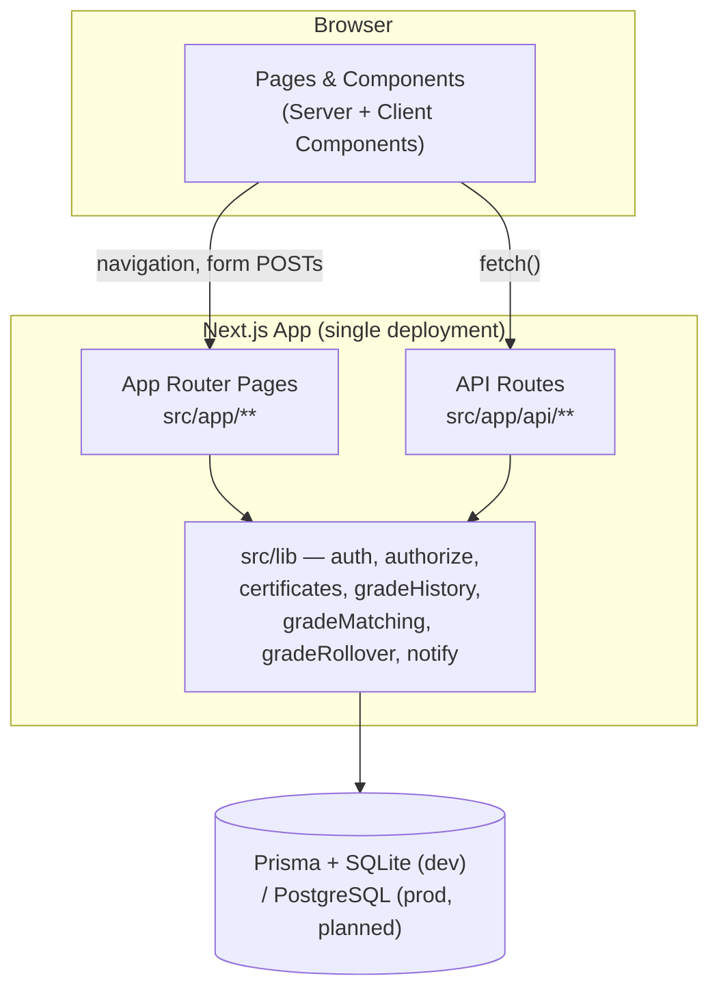

# MEGA.EDU — Project Overview

> Status legend used throughout `/docs`: **✅ Implemented** · **🟡 Designed/approved, not yet implemented** · **⚠️ Known gap/issue** · **🔭 Future/planned**
> Last verified: 2026-08-29 (Phase 3B), against the current codebase.

## What MEGA.EDU is

MEGA.EDU is a national education network connecting schools, teachers, students, parents, and education organizations under one identity system called **MEGA ID**. In plain terms: a school gets a public profile and a digital identity; teachers and students at that school get accounts a school administrator approves; organizations can publish online courses and post opportunities (scholarships, competitions, jobs); parents can follow their children's progress. Everyone — regardless of role — signs in with the same single account. See [MEGA_ID.md](MEGA_ID.md) and [USER_ROLES.md](USER_ROLES.md) for the identity/role model in detail.

## Overall purpose

The platform exists to give every school, teacher, and student in the network a verifiable digital presence: a school's identity isn't tied to a single administrator's login, a student's learning record and certificates follow *them* rather than staying locked inside one school's paperwork, and achievements (course completions, skills, certificates) are independently verifiable by anyone with the right link — an employer, another school, a scholarship committee.

## Major modules currently implemented ✅

- **MEGA ID** — one account, one or more roles, held by a real person.
- **Schools & Organizations** — verified directory listings, admin-managed, with staff/member approval workflows.
- **MEGA Academy** — free online courses published by organizations, with modules, lessons, enrollment, and completion tracking.
- **Certificates** — dynamically generated, verifiable credentials issued automatically on course completion, with a public no-login verification page and a designed owner-facing preview.
- **Academic Sessions & Grades ("Phase 2")** — a structured, fully-audited school-year/grade/promotion system: Initial Setup, per-grade Promotion (Promote/Repeat/Transfer/Leave), New Session rollover with a Pending/Unresolved safeguard so no student's outcome is ever silently guessed or lost, and an optional **Section** subdivision layer (Class 6 → A, B, C) with its own audited reassignment path — sections are never inherited across a promotion or a new session, always an explicit per-session choice.
- **Subjects & Teacher Academic Assignment ("Phase 3A")** — a school-wide, reusable Subject catalog; a per-session record of which subjects each grade offers (never carried forward, so past curricula stay reconstructable); and fine-grained Teacher Academic Assignments (teacher → session → grade → optional section → subject), with an overlap rule preventing a teacher from holding both a grade-wide and section-specific assignment for the same subject at once. Multiple different teachers may share a subject/grade/section — no teaching hierarchy exists. Includes `requireTeacherAssignment()`, a permission primitive built ahead of its first caller for later Phase 3 sub-phases.
- **School Academic Operations ("Phase 3B")** — daily-operations layer on top of Phase 3A: designated Grade Class Teachers / Section Teachers (`ClassTeacherAssignment`, grade-wide and section-specific allowed to coexist); daily student Attendance (one status per student per calendar day, audited corrections including remarks via `AttendanceAudit`); Teaching Plans and Units/Chapters with a teaching-progress status and a planned-total target kept as a separate, independently-settable figure; and Unit/Chapter Tests with a pre-created, per-student evaluation roster (`PENDING`/`EVALUATED`/`ABSENT`). Corrected a real semantic gap in `requireTeacherAssignment()`'s section-matching logic before building anything on top of it, and caught/fixed a live duplicate-assignment bug in `ClassTeacherAssignment` during verification.
- **Platform Admin command center** — real, live counts and verification queues for the whole network.
- **Interests & Skills** — self-declared interests, teacher-attested skills.
- **Notifications, Opportunities, Resources, Events, News** — lightweight supporting content types.

## Major modules not yet implemented 🟡 / 🔭

- **Payments** — modeled in the database (`Subscription`, `Payment`) but no payment processor is connected; paid course enrollment is explicitly blocked rather than attempted.
- **Certificate PDF export & QR codes** — the certificate's visual design is finished and approved; downloading it as a PDF and generating a scannable verification QR code are both still to build.
- **Grade-based certificates** — the certificate system was built to eventually support them (a reserved field exists), but the actual issuance path doesn't exist yet.
- **Automated tests** — none exist yet; see [TESTING.md](TESTING.md) for what verification practice is used instead.

## Technology stack

- **Framework**: Next.js 14 (App Router), React 18, TypeScript.
- **Database**: Prisma ORM 5.20, SQLite in development, PostgreSQL intended for production (not yet configured — see [DEPLOYMENT.md](DEPLOYMENT.md)).
- **Auth**: NextAuth 4, email/password (Credentials provider), JWT sessions.
- **Styling**: Tailwind CSS.
- **Validation**: `zod` on registration routes.
- **No test framework is installed.**

## Current development status

Two phases of work are complete and independently verified against the running application and real database state (not just typechecked):

| Phase | Scope | Status |
|---|---|---|
| Phase 1 | MEGA ID, roles, schools/orgs, MEGA Academy, certificates, Platform Admin dashboard | ✅ Complete |
| Phase 2 | Academic Sessions & Grades — schema, matching utility, Initial Setup, Promotion, New Session rollover | ✅ Complete, all six steps independently verified with real evidence (timing tests, database-level audit-trail checks, multi-session-chain tests) |
| Phase 2 — Sections | Optional `Section` subdivision of `SchoolGrade`, additive on top of Phase 2's schema: lifecycle (create/rename/deactivate, no hard-delete), audited reassignment (`reassignSection()`), Setup Wizard + Promotion Roster integration | ✅ Complete, verified with real evidence (live UI + database checks, server-side `isActive` enforcement bypassing the UI, a live promotion proving section is untouched by a decision, source-level confirmation that rollover never inherits section) |
| Phase 3A — Academic Structure | `Subject` catalog, session-scoped `GradeSubject` offering, `TeacherAcademicAssignment` (grade-wide/section-specific with overlap enforcement), `requireTeacherAssignment()` foundation, School Admin + Teacher read/manage UI | ✅ Complete, verified with real evidence (live overlap-rule tests in both orderings, multi-teacher coexistence, subject-not-offered rejection, DB-level integrity checks, and direct verification of the unused permission helper's query logic) |
| Phase 3B — School Academic Operations | Class/Section Teacher assignment, daily Attendance with audited corrections, Teaching Plans + Units/Chapters, Unit/Chapter Tests + evaluation, `requireClassTeacher()`, a correctness fix to `requireTeacherAssignment()`, and School Admin/Teacher/Student read-side UI | ✅ Complete, verified with real evidence (a live Section Teacher account rejected for out-of-scope actions via real `403`s, the `requireTeacherAssignment()` semantics fix independently verified before its first caller, a real `ClassTeacherAssignment` duplicate bug caught and fixed via a live test, and the full Teaching Plan → Unit → Test → Evaluation flow exercised end-to-end through the actual UI as School Admin, Teacher, and Student) |

Homework/assignments, examinations beyond Unit/Chapter Tests, report cards, analytics, and other later Phase 3 sub-phases have not been started — each will be designed and approved separately. No production deployment has occurred.

## High-level system architecture

A single Next.js application — pages and API routes live side by side, both talking to one Prisma-managed database. No separate backend service, no microservices.

See [ARCHITECTURE.md](ARCHITECTURE.md) for the detailed breakdown of this diagram, including auth and module relationships.

## Where to go next

- Building or reviewing a feature? Start with [ARCHITECTURE.md](ARCHITECTURE.md) for the conventions this codebase actually follows.
- Need the exact shape of the database? [DATABASE.md](DATABASE.md).
- Working on subjects, teacher assignments, or anything under `/dashboard/academics`? [ACADEMIC_STRUCTURE.md](ACADEMIC_STRUCTURE.md).
- Working on attendance, Class/Section Teachers, teaching units/progress, or unit tests? [ACADEMIC_OPERATIONS.md](ACADEMIC_OPERATIONS.md).
- Wondering whether a decision was deliberate? [PRODUCT_RULES.md](PRODUCT_RULES.md) documents every explicitly-approved rule with its rationale.
- Doing AI-assisted development on this codebase? Read [DEVELOPMENT_GUIDELINES.md](DEVELOPMENT_GUIDELINES.md) first.
- Wondering what's broken or missing? [KNOWN_GAPS.md](KNOWN_GAPS.md).
